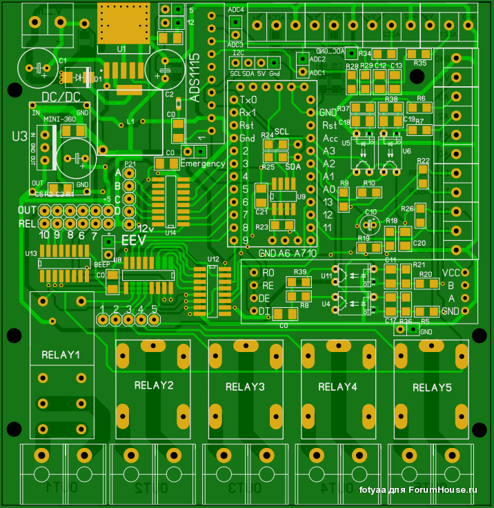

### CHPC: Cheap Heat Pump Controller v1.0

```diff
- NOW: purchasing components and PCBs, development will be resumed after arrival at ~April 2019 !
```


## Development

State: active

## PCB Design

There are 2 PCB designs: type "F" and type "G".

Both designs state: beta, untested.

## Type "F" features:
- **mostly SMD** componens,
- **internal power** source,
- **10** output channels,
- 4 input channels,
- 5 relays: 1 * 16A + 4 * 7A,
- buzzer,
- EEV support,
- 16 bit **i2c ADC: on board**,
- i2c devices: allowed, 
- T sensors: ds18b20 on one lane.

## Type "G" features:
- **no SMD** components,
- **external or board-placed** power source,
- **5** output channels,
- 4 input channels,
- 5 relays: 2 * 16A + 3 * 7A,
- buzzer,
- EEV support,
- 16 bit **i2c ADC: off board**,
- i2c devices: allowed,
- T sensors: ds18b20 on one lane.

# Type "F" PCB


# Type "G" PCB


....

....
Drafts below.

Sensors abbreviations:

| Abbr. | Full name |
| ----- | -------------------- |
| Tae | after evaporator |
| Tbe | before evaporator |
| Ttarget | target |
| Tsump | sump |
| Tci | cold in |
| Tco | cold out |
| Thi | hot in |
| Tho | hot out |
| Tbc | before condenser |
| Tac | after condenser |
| Touter | outer (outdoor) |
| Ts1 | additional sensor1 |
| Ts2 | additional sensor2 |


