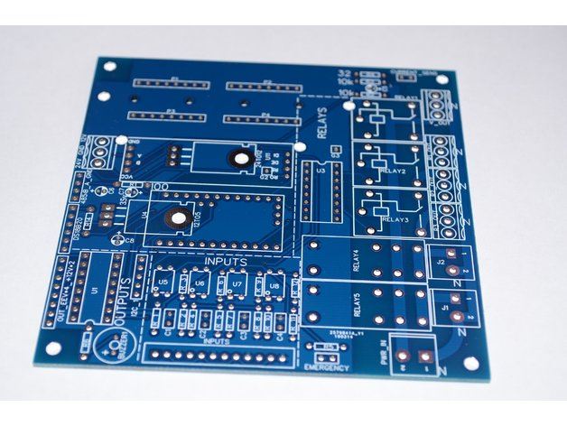

### CHPC: Cheap Heat Pump Controller v1.0
<b>The CHPC a minimal cost Heat Pump (HP) controller, which can be used as provided, or can be adopted to nearly all use cases due to open source nature.</b>
  
## Development

State: active
  
## Applications:
| Usage. |	Brief description. | 	Application examples	| Available protections	|
| ---------- | ------------------ | ------------------ | -------------------- |
| 1. Thermostat.	|  Precision thermostat. Simple and cheap.  Only 1 relay and 1 temperature sensor required.  | Room heat control. Chicken coop climate control. Distillation column or Yogurt maker t. control. Else. | N/A	|
| 2. Heat pump (HP) control. | Controller drives HP system components: compressor, Cold and Hot side Circulating Pumps (CP). Protects system from overload, overheat and freezing up. Drives EEV\* to optimize running conditions. | DIY heat pump system. Repair module for commercial system. Water heater, house heating systems and same. | Compressor: cold start or overheat. Discharge and suction lines protection. Short-term power loss. Anti-freeze. Power overload protection. |

\* under development

For more information about Heap Pumps look at [Wikipedia about HP](https://en.wikipedia.org/wiki/Heat_pump)
  
## Control interfaces:
 <b>None:</b> Target temperature uploaded to board with firmware and cannot be changed. System used as fixed thermostat. Target temperature can be changed later with firmware re-upload. 
 <b>0.96 OLED or 1602 LCD screen + buttons:</b> Simple, local screen controlled system. Remote control is not possible. 
 <b>Remote computer terminal over RS-485 line. </b> Target temperature and running conditions under remote control. User can get stats from all T sensors. Up to 1.2 kilometer line.\* 
 <b> Remote automated control/stats via RS-485.</b> Firmware was written with python scripting in mind (and real scripts at prototype 485 network). 
\* RS-485 specification. Hardware test succeeded on 400 meters line.
  
## Relays:
### "Thermostat":
Only 1 Relay: drives electric heater (any) 
### "Heat Pump". Capillary tube, TXV, EEV:
5 Relays, drives all you need:
* Compressor (can be used as external relay driver for High Power systems)
* Cold Circulating Pump (CP)
* Hot CP
* Sump Heater (optional, recommended for outdoor HP installations)
* 4-way Valve (support coming up: autumn 2019)
  
## Temperature sensors:
* Up to 13 temperature sensors can be connected to CHPC to control all processes that you want. 
* Only 1 sensor needed for "Thermostat" or "Heat Pump capillary/TXV" 
* 3 sensors needed for "HP with EEV" (absolute minimum scheme)
  
## Temperature sensors installation example (medium scheme)

  
 ## Get your own CHPC:
* download PCB gerber files
* search google [where to order PCB](https://www.google.com/search?q=order+pcb) or make your own at CNC machine
* order electronic components, see BOM (Bill Of Materials) list
* solder
* install firmware
* install CHPC at your system
* enjoy
  
## T sensors abbreviations:
This abbrevations used in interface during installation procedure

| Abbr. | Full name |
| ----- | -------------------- |
| Tae | after evaporator |
| Tbe | before evaporator |
| Ttarget | target |
| Tsump | sump |
| Tci | cold in |
| Tco | cold out |
| Thi | hot in |
| Tho | hot out |
| Tbc | before condenser |
| Tac | after condenser |
| Touter | outer (outdoor) |
| Ts1 | additional sensor1 |
| Ts2 | additional sensor2 |
  
 ## Photos:
 This is prototype 2.
 1602 is the best choise.
 
 
 
 
 
Prototype 1.
History ) But worked well for a season.
 
  
## BOM (Bill Of Materials), PCB v1.1:
| Type |	Name |	Quantity |	Case |	Comment |
| ---- | ---- | ----- | ---- | ---- |
| R	|	10k ¼W	|	2		
| R	|	1k ¼W	|	16		
| R	|	100 ¼W	|	1		
| R	|	22R ¼W	|	1		
| R	|	10R ¼W	|	1		
| Cap	|	0.1 uf	|	4		
| Cap	|	22uf_16v	|	4		
| IC	|	PC817C	|	2 or 4	|   |		DIP-4	2 if you use buttons instead of inputs
| Conn	|	DIP-16 bed	|	3	|	DIP-16	
| IC	|	ULN2003APG	|	2	|	DIP-16	
| IC	|	7805 TO-220	|	1	|	TO-220	
| IC	|	2n2222	|	1	|	TO-92	
| -	|	SMIH-12VDC-SL-C	|	2		
| -	|	SRD-12VDC-SL-C	|	3		
| Module	|	TTL_485_MODULE_8PIN	|	1		
| Module	|	ARDUINO PRO MINI 328P 5V	|	1		
| Conn	|	KF128 2.54_screw_1x2	|	1		
| Conn	|	KF128 2.54_screw_1x4	|	1		
| Conn	|	KF128 2.54_screw_1x6	|	1		
| Conn	|	KF128 2.54_screw_1x12	|	1		
| Conn	|	KF128 3.81_screw_3P	|	5		
| Conn	|	KF128 5.08_screw_2P	|	3		
| Conn	|	2.54_legs_female_x2	|	1		|	  |	like used at arduino mega
| Conn	|	2.54_legs_female_x3	|	1		
| Conn	|	2.54_legs_female_x4	|	2		
| Conn	|	2.54_legs_female_x12	|	2		
| Conn	|	2.54_pins	|	20		
| Button	|	momentary switch 6x6 2	|	2		
| Display	|	1602 LCD with i2c interface	|	1		
| -	|	buzzer	|	1	|	R9.0-2P-4.0PITCH	
| Module	|	LM2596S module	|	0 or 1	|	XX-to-12 stab	|	Needed only if you will use 24v as power source |
| -	|	power source, 12v1.25A 70x30x40|		1	|	70x30x40	 
| IC	|	ds18b20	|	6		|	 |	1 to 13, 6 recommended as fast start |
| Conv	|	usb→uart	|	1 | 	|			To upload firmware |
| - |	current sensor sct-013-000  |	1		
| Conv	|	rs485-USB	|	1 |	 |			To connect CHPC < - > PC/notebook |
